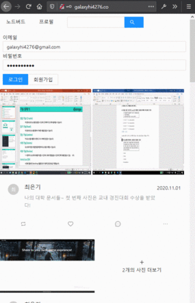
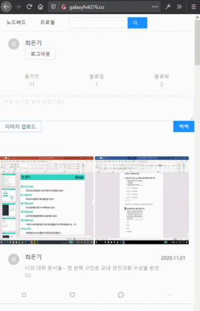

# React-Nodebird SNS 서비스
### ! 포트폴리오가 아닙니다. !

### 사용된 스택
| 구분 | 이름 |
|:---|:---|
|개발환경|Node.js 12.x on Window|
|프런트엔드|React|
|UX/UI|Ant Design|
|백엔드 | Express, Next |
|배포|AWS EC2 & S3 & lambda |

### 주소 -> http://galaxyhi4276.co/ ( 비용문제 때문에 닫았습니다. )

## 서비스 화면

&nbsp;&nbsp;&nbsp;

### 후기
* 리액트와 express를 사용하면서 트위터 SNS를 클론코딩하고 서버 두개 ( 프론트, 백) 기반으로
SSR과 SPA 를 지원하는 서비스에 대해서 이해하였습니다.
* 프로젝트를 진행하면서 프론트에서의 전반적인 상태관리와 리액트로 개발된 프론트가 어떻게 백엔드와 통신하느냐? (RESTful )에 대한 전반적인 궁금증을 해결
* 리액트 프레임워크를 이용한 프런트엔드 개발에 대한 이해가 되었음.

